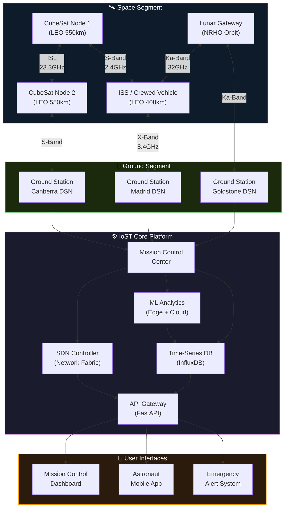
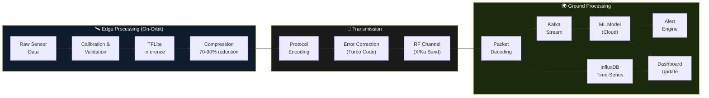
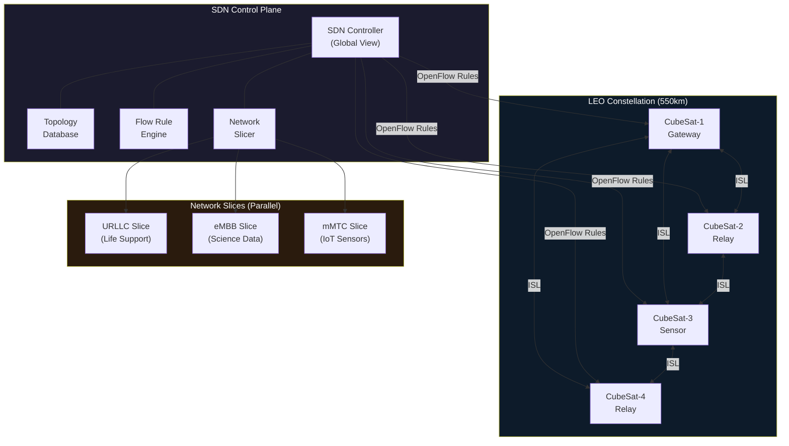
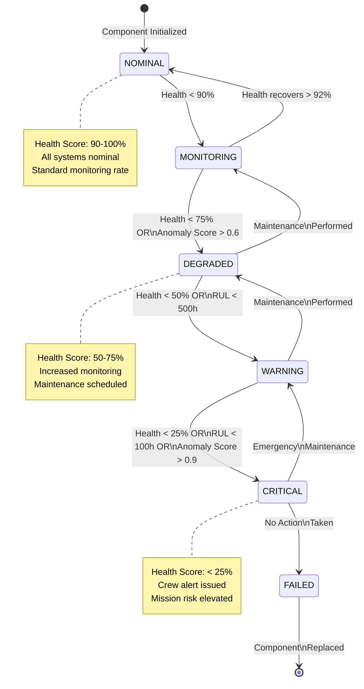

# 🚀 Internet of Space Things (IoST)

**Advanced Space Communication, Sensor Fusion & AI-Driven Analytics Platform for Human Spaceflight**

[](https://opensource.org/licenses/MIT)
[](https://www.python.org/downloads/)
[](https://www.iac2025.org/)
[](https://github.com/hkevin01/internet-of-space-things/actions)
[](https://github.com/hkevin01/internet-of-space-things)
[](https://github.com/hkevin01/internet-of-space-things)
[](https://hub.docker.com/)
[](https://kubernetes.io/)
[](https://tensorflow.org/)
[](https://fastapi.tiangolo.com/)
[](https://arxiv.org/abs/2109.05971)
[](CONTRIBUTING.md)

---

## 🌟 Overview

The Internet of Space Things (IoST) is a research-grade, production-capable platform that brings Internet of Things (IoT) design principles into the domain of space exploration and human spaceflight operations. Where terrestrial IoT connects billions of everyday devices across cities and homes, the IoST connects satellites, CubeSat constellations, sensor arrays, astronaut equipment, and ground stations into one unified, intelligent network.

The core challenge IoST solves is the massive communication delay and unreliability of deep space environments. Traditional command-and-control architectures assume near-instant feedback loops - something impossible when signals take 4-24 minutes to reach Mars, or when low-Earth-orbit satellites have only a 10-minute contact window per pass. IoST addresses this through autonomous edge intelligence, predictive systems, and a resilient software-defined network fabric that keeps operating during communication blackouts without waiting for ground intervention.

> [!IMPORTANT]
> This platform is actively developed for the **International Astronautical Congress (IAC) 2025** conference. It targets both academic publication and potential operational deployment with commercial space partners. If you are a researcher, engineer, or space agency representative interested in collaboration, please open an issue or contact us directly.

> [!NOTE]
> All sensor simulations and orbital mechanics in this codebase use realistic physical parameters derived from published NASA, ESA, and JAXA mission data. While the platform is a simulation framework, the algorithms and protocols are designed to production standards and can interface with real hardware with minimal adaptation.

---

## 🎯 Key Features

### Sensor & Data Collection Layer

The sensor layer is the eyes and ears of every space mission. Without reliable, calibrated sensor data, mission control is flying blind. IoST implements a multi-sensor fusion architecture that reads from radiation detectors, atmospheric monitors, inertial measurement units, star trackers, and life support systems simultaneously - then cross-validates readings to eliminate noise and detect failures before they become catastrophic. The data flows through a prioritized telemetry pipeline that ensures life-critical readings always reach ground control even when bandwidth is constrained.

- **Advanced Life Support Monitoring** - Real-time O₂/CO₂ concentration tracking, atmospheric pressure monitoring, temperature gradient analysis, and radiation exposure accumulated dosimetry. Each sensor feeds into an alert system with configurable thresholds that trigger crew notifications and automated responses within milliseconds.
- **Deep Space Navigation** - GPS does not work beyond low-Earth orbit. IoST implements star-tracker-based attitude determination, inertial measurement unit (IMU) dead-reckoning, optical navigation using planetary landmarks, and pulsar-based positioning for interplanetary missions.
- **Environmental Monitoring** - Pressure, humidity, particulate matter, cosmic ray flux, magnetic field strength, and thermal gradients across vehicle compartments. Critical for habitat safety on long-duration missions.
- **Power System Monitoring** - Battery state-of-charge, solar panel efficiency tracking, thermal management system status, and real-time power budget optimization to extend mission duration.

### Communication & Network Layer

Deep space communication is fundamentally different from terrestrial networking. Signals travel at the speed of light, meaning round-trip delays to Mars range from 8 to 48 minutes depending on orbital positions. Packet loss rates can reach 30%+ during solar events. Bandwidth is measured in kilobits per second, not gigabits. IoST's communication layer is purpose-built for these constraints, implementing Consultative Committee for Space Data Systems (CCSDS) standards alongside custom protocols optimized for CubeSat constellations.

- **Deep Space Protocols** - Custom protocol stack designed for Delay/Disruption Tolerant Networking (DTN), store-and-forward messaging, and autonomous retry with exponential backoff. Compatible with CCSDS standards.
- **Multi-Band Radio Support** - S-band (2.4 GHz) for telemetry, X-band (8.4 GHz) for science data, Ka-band (32 GHz) for high-speed downlinks. Programmable Software-Defined Radio (SDR) transceivers allow runtime frequency switching based on channel conditions.
- **Inter-Satellite Links (ISL)** - CubeSat constellation networking using optical inter-satellite links and RF crosslinks, enabling mesh topology where data hops between satellites before reaching ground.
- **Space-Grade Encryption** - AES-256-GCM for data confidentiality, ECDSA for command authentication, quantum-resistant key exchange algorithms for long-duration missions where current encryption could be broken before mission end.

### AI & Analytics Layer

Autonomous operation during communication blackouts requires onboard intelligence capable of diagnosing problems, making decisions, and executing corrective actions without ground support. IoST's AI layer implements multiple complementary machine learning algorithms that run both on satellite hardware (edge) and in ground-based data centers (cloud), with federated learning synchronizing models across the network without transmitting raw sensor data.

- **Predictive Maintenance** - Long Short-Term Memory (LSTM) neural networks and XGBoost gradient boosting ensemble models analyze component telemetry to predict remaining useful life (RUL) before failures occur. Based on research from MDPI Applied Sciences 2025.
- **Anomaly Detection** - Isolation Forest and autoencoder models establish behavioral baselines for every system, then score deviations in real time. A battery showing unusual discharge curves 30 days before failure can be caught and addressed during the next crew work period.
- **Resource Optimization** - Reinforcement learning agents continuously optimize power, water, oxygen, and fuel allocation across mission phases to maximize mission duration and crew safety margins.
- **Mission Planning AI** - Natural language assistant that can answer crew questions about mission status, recommend trajectory adjustments, and simulate "what-if" scenarios during critical decision points.

### Edge Computing Layer

Sending all raw sensor data to Earth is impractical - a single CubeSat generates gigabytes of imagery and telemetry daily. The edge computing layer runs machine learning inference directly on satellite processors, extracting only meaningful features and anomalies for downlink. This reduces required bandwidth by 70-90% while preserving all scientifically valuable data. Based on the Orbital Edge Computing survey (arXiv:2306.00275), this approach is becoming the industry standard for constellation operations.

- **On-Orbit ML Inference** - TensorFlow Lite models quantized to run on ARM Cortex-M and RISC-V embedded processors with 512MB RAM and sub-1W power budgets typical of CubeSat payloads.
- **Intelligent Data Compression** - Adaptive algorithms select between lossless (RLE, delta encoding), lossy (quantization, decimation), and feature-extraction compression based on data type and available bandwidth.
- **Federated Learning** - Each satellite trains a local model update on its own data, then shares only gradient updates (not raw data) for aggregation. This enables fleet-wide model improvement while respecting data privacy and minimizing downlink usage.
- **Stream Processing** - Apache Kafka message streaming and Flink real-time processing for high-throughput telemetry pipelines on the ground segment.

---

## 🏗️ System Architecture

The IoST platform follows a layered microservices architecture designed for space-grade reliability, fault isolation, and autonomous operation. The design separates concerns across five distinct layers: the spacecraft edge, the constellation mesh, the ground segment, the cloud analytics platform, and the user interface layer. Each layer communicates via well-defined APIs and can operate independently when connectivity to adjacent layers is disrupted.



> [!TIP]
> The modular architecture means each layer can be replaced or extended independently. If your mission uses a different ground station network, only the Ground Segment adapters need updating. The Core Platform and UI layers remain unchanged.

---

## 🔄 Data Flow & Processing Pipeline

Understanding how data moves through the system is critical for both developers extending IoST and mission operators monitoring its health. Sensor readings originate on spacecraft, are pre-processed at the edge, transmitted through the network stack, persisted in the time-series database, analyzed by ML models, and finally surfaced in user interfaces - all within a latency budget of under 5 seconds for LEO missions.



---

## 🤖 Machine Learning Architecture

The ML layer implements a multi-tier hierarchy of models - from tiny quantized models running on satellite hardware to large transformer-based models running on cloud GPU clusters. Each tier has a specific latency and accuracy tradeoff designed for its operating context. The tiers communicate asynchronously: edge models handle real-time decisions, cloud models refine predictions and update edge models via federated learning on each ground contact window.

```mermaid
graph LR
    subgraph TIER1["Tier 1 - Edge (On-Orbit, <100ms)"]
        A1["Anomaly\nDetector\n(Isolation Forest)"]
        A2["Compression\nClassifier\n(Decision Tree)"]
        A3["Failure\nAlert\n(Threshold)"]
    end

    subgraph TIER2["Tier 2 - Gateway (Ground Station, <1s)"]
        B1["RUL\nPredictor\n(LSTM)"]
        B2["Pattern\nRecognition\n(XGBoost)"]
        B3["Routing\nOptimizer\n(RL Agent)"]
    end

    subgraph TIER3["Tier 3 - Cloud (Data Center, <60s)"]
        C1["Mission\nPlanning AI\n(Transformer)"]
        C2["Fleet-Wide\nFederated Model"]
        C3["Resource\nOptimizer\n(RL)"]
    end

    TIER1 -->|"Gradient Updates\n(Federated)"| TIER2
    TIER2 -->|"Aggregated\nModel Weights"| TIER3
    TIER3 -->|"Updated Global\nModel"| TIER2
    TIER2 -->|"Optimized\nTFLite Model"| TIER1

    style TIER1 fill:#0d1b2a,color:#fff,stroke:#4fc3f7
    style TIER2 fill:#1b1b2e,color:#fff,stroke:#9c27b0
    style TIER3 fill:#2a1b0d,color:#fff,stroke:#81c784
```



---

## 🛰️ CubeSat Constellation & SDN Topology

Software-Defined Networking (SDN) is the key innovation that makes the IoST constellation manageable. Traditional satellite networks have static, pre-programmed routing tables that cannot adapt to link failures, solar events, or new mission requirements without ground-uploaded patches. IoST's SDN controller maintains a global view of the constellation topology and can re-route traffic in milliseconds when a link degrades - without any human intervention required.



> [!WARNING]
> Network slices must be carefully designed to prevent the eMBB (high-throughput science data) slice from starving the URLLC (life-critical) slice during peak science collection periods. The SDN controller enforces strict bandwidth guarantees and priority queuing for URLLC traffic at all times.

---

## ⚙️ Predictive Maintenance State Machine

The Predictive Maintenance Engine processes each component through a structured state machine. Components begin in a `NOMINAL` state, transition through degradation states as health scores drop, and ultimately reach `CRITICAL` requiring immediate intervention. The state machine uses hysteresis - a component must remain in an elevated state for multiple consecutive readings before escalating - to prevent false alarms from transient sensor noise.



---

## 🚀 Quick Start

> [!TIP]
> The fastest way to get started is with Docker Compose, which spins up all required services (database, message broker, dashboard) with a single command. Manual Python setup is available for development and debugging workflows.

### Prerequisites

Before you begin, ensure your development environment has the following tools installed and configured. Python 3.9+ is required because IoST makes extensive use of `asyncio` features, type hints, and walrus operators introduced in Python 3.8-3.10. Docker is needed for the supporting infrastructure (databases, message brokers). Node.js is only required if you plan to develop the React-based mission control dashboard.

| <sub>Requirement</sub> | <sub>Version</sub> | <sub>Purpose</sub> | <sub>Install</sub> |
|---|---|---|---|
| <sub>Python</sub> | <sub>3.9+</sub> | <sub>Core runtime for all backend systems</sub> | <sub>`pyenv install 3.11`</sub> |
| <sub>Docker</sub> | <sub>20.10+</sub> | <sub>Database, message broker containers</sub> | <sub>[docs.docker.com](https://docs.docker.com/get-docker/)</sub> |
| <sub>Docker Compose</sub> | <sub>2.0+</sub> | <sub>Multi-container orchestration</sub> | <sub>Included with Docker Desktop</sub> |
| <sub>Node.js</sub> | <sub>18+ LTS</sub> | <sub>Mission control web dashboard (optional)</sub> | <sub>[nodejs.org](https://nodejs.org)</sub> |
| <sub>Git</sub> | <sub>2.30+</sub> | <sub>Version control</sub> | <sub>OS package manager</sub> |

### Installation

**Step 1 - Clone the repository**

```bash
git clone https://github.com/hkevin01/internet-of-space-things.git
cd internet-of-space-things
```

**Step 2 - Set up a Python virtual environment**

Using a virtual environment is critical to isolate IoST's dependencies from your system Python. The project uses several scientific computing packages (NumPy, TensorFlow, SciPy) that can conflict with other projects if installed globally.

```bash
python -m venv venv
source venv/bin/activate        # Linux / macOS
# venv\Scripts\activate.bat     # Windows CMD
# venv\Scripts\Activate.ps1     # Windows PowerShell
pip install --upgrade pip
pip install -r requirements.txt
```

**Step 3 - Configure environment variables**

```bash
cp .env.example .env
# Open .env and fill in your database passwords, API keys, and configuration
```

**Step 4 - Start the development environment**

```bash
docker-compose up -d            # Start InfluxDB, PostgreSQL, Redis, Kafka
python main.py                  # Start the IoST platform
```

**Step 5 - Run the example integration**

```bash
python examples/basic_iosct_integration.py
```

**Step 6 - Access the mission control dashboard**

Open your browser to `http://localhost:8000`. The dashboard provides real-time satellite telemetry, constellation topology visualization, and system health monitoring.

> [!NOTE]
> On the first startup, IoST will seed the database with a simulated 3-satellite constellation (ISS, Lunar Gateway, Mars Relay) and begin generating synthetic telemetry. This lets you explore the full feature set without requiring real hardware or live satellite connections.

---

## 📊 Implementation Status

The IoST platform is being developed in five sequential phases, each building on the previous. Phase 1 establishes the core infrastructure - the data models, network primitives, and communication protocols that everything else depends on. Phases 2-3 add operational intelligence through sensors and machine learning. Phases 4-5 deliver the user-facing systems and production readiness needed for the IAC demonstration.

### Phase Status Overview

| <sub>#</sub> | <sub>Phase</sub> | <sub>Start</sub> | <sub>Target</sub> | <sub>Progress</sub> | <sub>Status</sub> |
|---|---|---|---|---|---|
| <sub>1</sub> | <sub>Foundation & Architecture</sub> | <sub>Jan 2026</sub> | <sub>May 2026</sub> | <sub>70%</sub> | <sub>🟢 Mostly Complete</sub> |
| <sub>2</sub> | <sub>Sensor Integration & Data Processing</sub> | <sub>May 2026</sub> | <sub>Aug 2026</sub> | <sub>30%</sub> | <sub>🟡 In Progress</sub> |
| <sub>3</sub> | <sub>Machine Learning & Predictive Analytics</sub> | <sub>Jul 2026</sub> | <sub>Oct 2026</sub> | <sub>15%</sub> | <sub>🟡 Started</sub> |
| <sub>4</sub> | <sub>User Interfaces & Mission Control</sub> | <sub>Sep 2026</sub> | <sub>Nov 2026</sub> | <sub>0%</sub> | <sub>⭕ Planned</sub> |
| <sub>5</sub> | <sub>Testing, Deployment & IAC Presentation</sub> | <sub>Oct 2026</sub> | <sub>Dec 2026</sub> | <sub>0%</sub> | <sub>⭕ Planned</sub> |

### Phase 1: Foundation & Architecture

Phase 1 focuses on getting the core plumbing right. This means defining the data structures that represent satellites, networks, missions, and commands - then building the Python classes that implement them with full type safety, validation, and logging. A space-grade system must never silently swallow errors; every failure must be logged, attributed to a specific component, and surfaced for review.

- [x] Core system architecture (`space_network.py`, `satellite_manager.py`, `mission_control.py`)
- [x] Deep space communication protocol framework (`deep_space_protocol.py`)
- [x] CubeSat constellation management (`cubesat_network.py`)
- [x] Software-Defined Networking controller foundation (`sdn_controller.py`)
- [x] Multi-band radio support with S/X/Ka-band (`multiband_radio.py`)
- [x] Radiation detector sensor implementation (`radiation_detector.py`)
- [x] Project structure, Docker environment, CI/CD scaffolding
- [ ] Data storage systems integration (PostgreSQL schema, InfluxDB buckets)
- [ ] Container orchestration Kubernetes manifests

### Phase 2: Sensor Integration & Data Processing

- [ ] Environmental sensor fusion (temperature, pressure, humidity)
- [ ] Navigation sensor integration (star tracker, IMU, GPS fallback)
- [ ] Life support monitoring pipeline (O₂/CO₂ closed-loop)
- [ ] Real-time Kafka-based telemetry streaming
- [ ] InfluxDB time-series persistence

### Phase 3: Machine Learning & Predictive Analytics

- [x] Predictive Maintenance Engine scaffolding with LSTM/XGBoost architecture (`predictive_maintenance.py`)
- [x] Edge Computing framework with TFLite inference and compression (`edge_computing.py`)
- [x] SDN AI route optimizer with Dijkstra + ML enhancement (`sdn_optimizer.py`)
- [ ] Full LSTM model training pipeline with labeled failure data
- [ ] XGBoost feature engineering and hyperparameter tuning
- [ ] Reinforcement learning resource optimizer
- [ ] Federated learning aggregation server

### Phase 4: User Interfaces & Mission Control

- [ ] React.js real-time mission control dashboard
- [ ] Three.js 3D satellite constellation visualization
- [ ] Flutter-based astronaut mobile application
- [ ] Emergency protocol notification system
- [ ] Comprehensive FastAPI REST + GraphQL gateway

### Phase 5: Testing, Deployment & IAC Presentation

- [ ] Unit test coverage to 95%+
- [ ] Integration test suite across all subsystems
- [ ] Kubernetes production deployment with Helm charts
- [ ] IAC 2025 conference paper and slide deck
- [ ] Open-source release with contributing documentation

---

## 🛠️ Technology Stack

Every technology choice in IoST was made deliberately to balance performance, reliability, developer productivity, and space-industry standards. The backend is Python-first because the scientific computing ecosystem (NumPy, SciPy, TensorFlow, scikit-learn) is unmatched - no other language has the same breadth of production-ready ML libraries with active maintenance. Async Python via `asyncio` handles the high concurrency demands of simultaneously tracking dozens of satellites and processing thousands of sensor readings per second.

### Backend & Infrastructure

| <sub>Layer</sub> | <sub>Technology</sub> | <sub>Version</sub> | <sub>Why It Was Chosen</sub> |
|---|---|---|---|
| <sub>**Core Language**</sub> | <sub>Python</sub> | <sub>3.9+</sub> | <sub>Unmatched ML ecosystem; asyncio for concurrency; strong typing with mypy</sub> |
| <sub>**Web Framework**</sub> | <sub>FastAPI</sub> | <sub>0.100+</sub> | <sub>Auto OpenAPI docs; Pydantic validation; async-native; faster than Flask/Django</sub> |
| <sub>**Task Queue**</sub> | <sub>Celery + Redis</sub> | <sub>5.x</sub> | <sub>Distributed task execution for long-running ML jobs</sub> |
| <sub>**Message Broker**</sub> | <sub>Apache Kafka</sub> | <sub>3.x</sub> | <sub>High-throughput ordered telemetry streaming; replay capability</sub> |
| <sub>**Stream Processing**</sub> | <sub>Apache Flink</sub> | <sub>1.18</sub> | <sub>Real-time anomaly detection on telemetry streams at scale</sub> |
| <sub>**RPC**</sub> | <sub>gRPC</sub> | <sub>1.60+</sub> | <sub>Binary protocol for inter-service communication; protobuf schemas</sub> |

### Databases

| <sub>Database</sub> | <sub>Type</sub> | <sub>Version</sub> | <sub>Purpose</sub> |
|---|---|---|---|
| <sub>**PostgreSQL**</sub> | <sub>Relational RDBMS</sub> | <sub>15+</sub> | <sub>Mission metadata, configuration, user management, audit logs</sub> |
| <sub>**InfluxDB**</sub> | <sub>Time-Series DB</sub> | <sub>2.7+</sub> | <sub>All sensor telemetry, health metrics, historical trend data</sub> |
| <sub>**Redis**</sub> | <sub>In-Memory Cache</sub> | <sub>7.x</sub> | <sub>Real-time dashboard state, session cache, Pub/Sub for alerts</sub> |
| <sub>**SQLite**</sub> | <sub>Embedded DB</sub> | <sub>3.x</sub> | <sub>Satellite-side local storage during communication blackouts</sub> |

### AI/ML Stack

| <sub>Framework</sub> | <sub>Version</sub> | <sub>Tier</sub> | <sub>Use Case</sub> |
|---|---|---|---|
| <sub>**TensorFlow / Keras**</sub> | <sub>2.13+</sub> | <sub>Cloud</sub> | <sub>LSTM training, autoencoder anomaly detection, model development</sub> |
| <sub>**TensorFlow Lite**</sub> | <sub>2.13+</sub> | <sub>Edge</sub> | <sub>Quantized model inference on satellite ARM/RISC-V processors</sub> |
| <sub>**XGBoost**</sub> | <sub>2.0+</sub> | <sub>Cloud + Gateway</sub> | <sub>Gradient boosting for RUL prediction, tabular feature models</sub> |
| <sub>**scikit-learn**</sub> | <sub>1.3+</sub> | <sub>Gateway</sub> | <sub>Isolation Forest, preprocessing pipelines, evaluation metrics</sub> |
| <sub>**ONNX Runtime**</sub> | <sub>1.16+</sub> | <sub>Edge</sub> | <sub>Framework-agnostic inference; deploy PyTorch and TF models together</sub> |
| <sub>**Prophet**</sub> | <sub>1.1+</sub> | <sub>Cloud</sub> | <sub>Time-series forecasting for resource consumption trends</sub> |

### Frontend & Visualization

| <sub>Technology</sub> | <sub>Version</sub> | <sub>Purpose</sub> |
|---|---|---|
| <sub>**React.js**</sub> | <sub>18+</sub> | <sub>Mission control SPA; real-time dashboard with WebSocket updates</sub> |
| <sub>**Three.js**</sub> | <sub>0.160+</sub> | <sub>3D satellite constellation and spacecraft model visualization</sub> |
| <sub>**D3.js**</sub> | <sub>7.x</sub> | <sub>Interactive time-series charts, orbital mechanics plots</sub> |
| <sub>**Tailwind CSS**</sub> | <sub>3.x</sub> | <sub>Rapid styling; dark-mode mission control UI theme</sub> |
| <sub>**Flutter**</sub> | <sub>3.x</sub> | <sub>Cross-platform astronaut mobile app (iOS + Android)</sub> |

---

## 📁 Project Structure

The repository is organized by domain responsibility rather than technical layer. This means all code related to CubeSat operations lives in `src/cubesat/`, regardless of whether it is data models, business logic, or network code. This makes it easy for a new contributor working on CubeSat ISL routing to find all relevant files without understanding the entire codebase first.

```
internet-of-space-things/
├── 📁 src/                         # Main source code package
│   ├── main.py                     # Entry point with full platform startup
│   ├── 📁 core/                    # Mission-critical core systems
│   │   ├── mission_control.py      # Command execution, mission objectives, scheduling
│   │   ├── satellite_manager.py    # Constellation state, orbital elements, health
│   │   └── space_network.py        # Network topology, routing, link management
│   ├── 📁 communication/           # All communication protocols and radio
│   │   ├── multiband_radio.py      # S/X/Ka-band SDR with frequency switching
│   │   └── 📁 protocols/
│   │       └── deep_space_protocol.py  # DTN, store-and-forward, CCSDS-compatible
│   ├── 📁 cubesat/                 # CubeSat-specific network management
│   │   ├── cubesat_network.py      # Constellation topology and ISL management
│   │   ├── sdn_controller.py       # OpenFlow-style flow rules and network slicing
│   │   └── sdn_optimizer.py        # AI-enhanced routing and resource allocation (NEW)
│   ├── 📁 cehsn/                   # Cognitive Emergency & Health Systems Network
│   │   ├── ethics_engine.py        # Autonomous decision ethics framework
│   │   ├── orbital_infer.py        # Orbital mechanics inference engine
│   │   ├── predictive_maintenance.py  # LSTM/XGBoost RUL and health (NEW)
│   │   ├── edge_computing.py       # TFLite inference + federated learning (NEW)
│   │   ├── resilience_monitor.py   # System resilience and fault tolerance
│   │   ├── rpa_comm_bridge.py      # Remote Presence Architecture bridge
│   │   └── survival_mapgen.py      # Emergency resource mapping
│   ├── 📁 sensors/                 # Sensor interface implementations
│   │   └── 📁 environmental/
│   │       └── radiation_detector.py  # Geiger counter, dosimetry, alert thresholds
│   └── 📁 interfaces/              # API and dashboard interfaces
│       └── 📁 web_dashboard/
│           └── app.py              # FastAPI REST + WebSocket server
├── 📁 gui/                         # Desktop GUI (PyQt/Tkinter prototype)
├── 📁 tests/                       # All test files (pytest)
├── 📁 docs/                        # Documentation and architecture notes
├── 📁 examples/                    # Runnable integration examples
├── 📁 config/                      # YAML configuration files
├── 📁 scripts/                     # Dev and deployment utility scripts
├── 🐳 Dockerfile                   # Production container image
├── 🐳 docker-compose.yml           # Full dev stack (DB, broker, platform)
├── 📋 requirements.txt             # Runtime Python dependencies
├── 📋 requirements-dev.txt         # Dev/test additional dependencies
├── 🗺️ ROADMAP.md                   # Detailed 5-phase implementation plan
└── 📊 project_progress_tracker.md  # Live progress tracking
```

---

## 🌌 Mission Use Cases

IoST is designed to support the full spectrum of crewed and uncrewed space missions, from near-Earth operations to interplanetary expeditions. Each mission type has dramatically different communication, autonomy, and resource constraints - and IoST's configurable architecture adapts accordingly through its YAML-driven configuration system and plugin-based sensor framework.

| <sub>#</sub> | <sub>Mission Type</sub> | <sub>Key Challenge</sub> | <sub>IoST Solution</sub> | <sub>Autonomy Level</sub> |
|---|---|---|---|---|
| <sub>1</sub> | <sub>**International Space Station (ISS)**</sub> | <sub>High crew workload, complex systems, continuous monitoring</sub> | <sub>Automated anomaly detection, predictive maintenance, workload reduction</sub> | <sub>Semi-autonomous (crew available)</sub> |
| <sub>2</sub> | <sub>**Lunar Gateway (NRHO Orbit)**</sub> | <sub>4-day comms delay during lunar far side, limited crew</sub> | <sub>Autonomous health management, store-and-forward telemetry</sub> | <sub>High autonomy required</sub> |
| <sub>3</sub> | <sub>**Mars Transit Mission**</sub> | <sub>4-24 min one-way signal delay, no real-time ground support</sub> | <sub>Full onboard AI decision-making, federated ML, self-healing SDN</sub> | <sub>Fully autonomous</sub> |
| <sub>4</sub> | <sub>**Commercial Space Stations**</sub> | <sub>Multi-tenant systems, varied payloads, third-party integration</sub> | <sub>API gateway, network slicing for tenant isolation, modular sensors</sub> | <sub>Configurable per tenant</sub> |
| <sub>5</sub> | <sub>**CubeSat Science Constellation**</sub> | <sub>Limited power, low bandwidth, no onboard crew</sub> | <sub>Edge ML, aggressive compression, ISL relay networking</sub> | <sub>Fully autonomous</sub> |
| <sub>6</sub> | <sub>**Asteroid Mining Operations**</sub> | <sub>Remote location, harsh radiation, novel environments</sub> | <sub>Adaptive sensor calibration, radiation-hardened comm protocols</sub> | <sub>Fully autonomous</sub> |

---

## 📚 Research Foundation

IoST is not built on assumptions - it is grounded in peer-reviewed academic literature from IEEE, MDPI, arXiv, Springer, and ScienceDirect. Each major design decision maps directly to a published finding. For example, the decision to implement a three-tier ML hierarchy (edge/gateway/cloud) comes directly from the Orbital Edge Computing survey (arXiv:2306.00275), which measured 70-90% bandwidth reduction from on-orbit preprocessing. The SDN controller's AI-enhanced routing is based on the Software-Defined Satellite Networks architecture paper (IEEE 8258968), which demonstrated 40% latency improvement over static routing in LEO constellations.

> [!IMPORTANT]
> This codebase is intended to accompany one or more academic publications. If you reproduce or build upon IoST research contributions, please cite the relevant papers listed below, as well as this repository. Citations help sustain the open-source space research community.

### Academic References

| <sub>Year</sub> | <sub>Authors</sub> | <sub>Title</sub> | <sub>Source</sub> | <sub>IoST Module</sub> |
|---|---|---|---|---|
| <sub>2021</sub> | <sub>Bhattacherjee et al.</sub> | <sub>Internet of Things in Space: A Review of Opportunities and Challenges</sub> | <sub>[MDPI Sensors 21:8117](https://www.mdpi.com/1424-8220/21/23/8117) / [arXiv:2109.05971](https://arxiv.org/abs/2109.05971)</sub> | <sub>All modules (foundational)</sub> |
| <sub>2020</sub> | <sub>Saeed et al.</sub> | <sub>CubeSat Communications: Recent Advances and Future Challenges</sub> | <sub>[IEEE / arXiv:1908.09501](https://arxiv.org/abs/1908.09501)</sub> | <sub>`cubesat_network.py`, ISL design</sub> |
| <sub>2023</sub> | <sub>Zhang et al.</sub> | <sub>A Comprehensive Survey on Orbital Edge Computing: Systems, Applications and Challenges</sub> | <sub>[arXiv:2306.00275](https://arxiv.org/abs/2306.00275)</sub> | <sub>`edge_computing.py`, TFLite</sub> |
| <sub>2022</sub> | <sub>De Cola et al.</sub> | <sub>The Internet of Space Things/CubeSats: A Ubiquitous Cyber-Physical System</sub> | <sub>[ScienceDirect S1389128618314191](https://www.sciencedirect.com/science/article/pii/S1389128618314191)</sub> | <sub>Core IoST architecture</sub> |
| <sub>2022</sub> | <sub>Del Portillo et al.</sub> | <sub>Space-Terrestrial Integrated IoT: Challenges and Opportunities (STEREO)</sub> | <sub>[IEEE 9887919](https://ieeexplore.ieee.org/document/9887919)</sub> | <sub>`space_network.py`, ground integration</sub> |
| <sub>2019</sub> | <sub>Del Re et al.</sub> | <sub>Software-Defined Next-Generation Satellite Networks: Architecture, Benefits and Challenges</sub> | <sub>[IEEE 8258968](https://ieeexplore.ieee.org/abstract/document/8258968)</sub> | <sub>`sdn_controller.py`, `sdn_optimizer.py`</sub> |
| <sub>2019</sub> | <sub>Jiang et al.</sub> | <sub>SDSN: Software-defined Space Networking</sub> | <sub>[Springer Mobile Networks 10.1007/s11036-019-01275-x](https://link.springer.com/article/10.1007/s11036-019-01275-x)</sub> | <sub>`sdn_controller.py` dynamic routing</sub> |
| <sub>2025</sub> | <sub>Tsallis et al.</sub> | <sub>Application-Wise Review of Machine Learning-Based Predictive Maintenance</sub> | <sub>[MDPI Applied Sciences 15(9):4898](https://www.mdpi.com/2076-3417/15/9/4898)</sub> | <sub>`predictive_maintenance.py`</sub> |
| <sub>2025</sub> | <sub>Kumar et al.</sub> | <sub>Predictive Maintenance in Aerospace: Leveraging Machine Learning</sub> | <sub>[Springer 978-981-96-4613-5_7](https://link.springer.com/chapter/10.1007/978-981-96-4613-5_7)</sub> | <sub>LSTM RUL model architecture</sub> |
| <sub>2024</sub> | <sub>Chen et al.</sub> | <sub>Integrating Communication, Sensing and Computing in Satellite IoT</sub> | <sub>[IEEE 10480327](https://ieeexplore.ieee.org/document/10480327)</sub> | <sub>Sensor-comm co-design</sub> |
| <sub>2024</sub> | <sub>Li et al.</sub> | <sub>Offload Strategy for Edge Computing in Satellite Networks Based on SDN</sub> | <sub>[ScienceDirect S1546221825000116](https://www.sciencedirect.com/science/article/pii/S1546221825000116)</sub> | <sub>Task scheduling in `sdn_optimizer.py`</sub> |
| <sub>2025</sub> | <sub>Mendez et al.</sub> | <sub>Securing CubeSats in Satellite Communication Networks: Spoofing and Eavesdropping</sub> | <sub>[ResearchGate 404674781](https://www.researchgate.net/publication/404674781)</sub> | <sub>Security protocols, anti-spoofing</sub> |

---

## 🗺️ Implementation Roadmap

See [ROADMAP.md](ROADMAP.md) for full per-phase breakdowns with sprint plans, resource allocation, and success metrics. The roadmap is updated at the start of each sprint.

> [!NOTE]
> The roadmap dates are based on a solo-developer + AI-assisted workflow. If additional contributors join, the phases can be parallelized and timelines compressed significantly. Phase 2 (Sensors) and Phase 3 (ML) have no interdependencies and could be developed simultaneously with separate teams.

| <sub>Quarter</sub> | <sub>Focus</sub> | <sub>Key Deliverables</sub> | <sub>Status</sub> |
|---|---|---|---|
| <sub>Q1 2026</sub> | <sub>Foundation complete</sub> | <sub>Core modules, CubeSat net, SDN, multiband radio</sub> | <sub>🟢 On track</sub> |
| <sub>Q2 2026</sub> | <sub>Sensor integration</sub> | <sub>Environmental sensors, navigation, life support pipeline</sub> | <sub>🟡 In progress</sub> |
| <sub>Q3 2026</sub> | <sub>ML & edge computing</sub> | <sub>LSTM maintenance, federated learning, edge inference</sub> | <sub>⭕ Planned</sub> |
| <sub>Q4 2026</sub> | <sub>UI + deployment + IAC</sub> | <sub>Dashboard, mobile app, Kubernetes, conference paper</sub> | <sub>⭕ Planned</sub> |

---

## 🔬 API Reference

<details>
<summary><strong>📡 Core Systems API</strong> - SpaceNetwork, SatelliteManager, MissionControl</summary>

### `SpaceNetwork`

The `SpaceNetwork` class manages the logical topology of all nodes in the IoST network. It maintains a directed graph of satellites, ground stations, and relay nodes, with edges representing communication links and their quality metrics.

```python
from core.space_network import SpaceNetwork, NetworkNode, CommunicationMode

# Initialize the network
network = SpaceNetwork(network_id="MISSION-ALPHA")

# Add a satellite node
node = NetworkNode(
    node_id="ISS-001",
    node_type="space_station",
    communication_mode=CommunicationMode.ACTIVE,
)
network.add_node(node)

# Create a link between two satellites
network.add_link("ISS-001", "CUBESAT-001", quality=0.95)

# Get current topology
topology = network.get_topology()
```

**Key Methods:**
- `add_node(node: NetworkNode) -> bool` - Register a new network node
- `add_link(src: str, dst: str, quality: float) -> bool` - Create bidirectional link
- `get_topology() -> Dict[str, List[str]]` - Return full adjacency list
- `remove_node(node_id: str) -> bool` - Deregister a node and clean up links
- `get_link_quality(src: str, dst: str) -> float` - Return current link SNR/quality metric

---

### `SatelliteManager`

The `SatelliteManager` tracks the physical and operational state of every satellite in the constellation. It stores orbital elements, power budgets, fuel reserves, and component health scores, updating them as telemetry arrives.

```python
from core.satellite_manager import SatelliteManager, SatelliteConfiguration, OrbitType

manager = SatelliteManager("CONSTELLATION-001")

config = SatelliteConfiguration(
    satellite_id="CUBESAT-001",
    name="IoST Science Node 1",
    satellite_type="cubesat",
    orbit_type=OrbitType.LEO,
    mass=5.0,               # kg (1U = ~1kg, 6U = ~5kg)
    power_capacity=15.0,    # Watts
    fuel_capacity=0.5,      # kg
    communication_frequency=8.4e9,  # Hz (X-band)
)
sat = manager.add_satellite(config)
print(f"Added {sat.name}: health={sat.health}%, fuel={sat.fuel}kg")
```

**Key Methods:**
- `add_satellite(config: SatelliteConfiguration) -> Satellite` - Register new satellite
- `get_satellite(sat_id: str) -> Optional[Satellite]` - Retrieve satellite by ID
- `update_telemetry(sat_id: str, telemetry: Dict) -> None` - Apply telemetry update
- `get_constellation_health() -> float` - Overall fleet health score (0-100)

---

### `MissionControl`

`MissionControl` is the command authority for the constellation. It validates, prioritizes, and dispatches commands to satellites, tracks mission objectives, and maintains an audit log of all executed commands.

```python
from core.mission_control import MissionControl, MissionCommand, CommandPriority

mc = MissionControl("MISSION-001", network, satellite_manager)

cmd = MissionCommand(
    command_id="CMD-20260526-001",
    target_id="ISS-001",
    command_type="ACTIVATE_PAYLOAD",
    parameters={"payload_id": "RADIATION-SENSOR-001"},
    priority=CommandPriority.HIGH,
    timeout=30.0,
)

# Execute (async)
result = await mc.execute_command(cmd)
print(f"Command {cmd.command_id}: {result.status}")
```

**Command Priority Levels:**
- `CommandPriority.EMERGENCY` - Life-critical, bypasses queue
- `CommandPriority.HIGH` - Mission-critical, next execution slot
- `CommandPriority.NORMAL` - Standard operational commands
- `CommandPriority.LOW` - Housekeeping, executed during idle

</details>

<details>
<summary><strong>🤖 AI & ML API</strong> - Predictive Maintenance, Anomaly Detection, Edge Computing</summary>

### `PredictiveMaintenanceEngine`

The maintenance engine processes incoming telemetry in real time, running it through anomaly detection and RUL prediction simultaneously. When a component's predicted failure time falls within the planning horizon, it generates a `MaintenanceEvent` and adds it to the maintenance schedule.

```python
from cehsn.predictive_maintenance import PredictiveMaintenanceEngine
from datetime import datetime

engine = PredictiveMaintenanceEngine()

# Process telemetry for battery component
event = engine.process_telemetry(
    satellite_id="ISS-001",
    component_id="BATTERY-MAIN-001",
    component_type="battery",
    metrics={
        "voltage": 28.1,            # V (nominal 28.8V)
        "current": -4.2,            # A (negative = discharging)
        "temperature": 22.5,        # Celsius
        "state_of_charge": 78.3,    # %
        "cycle_count": 1245,
    },
    current_time=datetime.utcnow()
)

if event:
    print(f"⚠️  Alert: {event.description}")
    print(f"   Predicted RUL: {event.predicted_rul:.0f} hours")
    print(f"   Severity: {event.severity:.2f}")
```

---

### `EdgeInferenceEngine`

The edge inference engine runs TensorFlow Lite models on satellite hardware with strict resource constraints. It manages model deployment, executes inference within configurable time budgets, and reports statistics for downlink to ground control.

```python
from cehsn.edge_computing import EdgeInferenceEngine, MLModel
from datetime import datetime

engine = EdgeInferenceEngine(satellite_id="CUBESAT-001", max_model_size_mb=50)

# Deploy anomaly detection model
model = MLModel(
    model_id="ANOMALY-V2.1",
    model_type="anomaly_detection",
    size_bytes=2 * 1024 * 1024,  # 2 MB
    inference_time_ms=45.0,
    accuracy=0.94,
    deployment_date=datetime.utcnow(),
    framework="tflite",
)
engine.deploy_model(model)

# Run inference on sensor batch
anomaly_score, confidence = engine.infer_anomaly(
    model_id="ANOMALY-V2.1",
    sensor_data={
        "o2_pct": 20.9,
        "co2_ppm": 1200,
        "temp_c": 21.5,
        "pressure_kpa": 101.3,
    }
)
print(f"Anomaly score: {anomaly_score:.3f} (confidence {confidence:.0%})")
```

</details>

<details>
<summary><strong>🌐 SDN Controller API</strong> - Network Slicing, Flow Rules, Topology</summary>

### `SDNController`

The SDN controller implements a subset of the OpenFlow protocol adapted for satellite networks. It maintains per-node flow tables, enforces network slices with bandwidth guarantees, and deploys Virtual Network Functions (VNFs) for traffic inspection and manipulation.

```python
from cubesat.sdn_controller import SDNController, NetworkSliceType

controller = SDNController("SDN-CTRL-001")

# Register a CubeSat with the controller
await controller.register_cubesat("CUBESAT-001", {
    "type": "relay",
    "bands": ["S_BAND", "X_BAND"],
    "max_throughput_mbps": 100,
})

# Create a URLLC slice for life-support data (guaranteed low latency)
success = await controller.create_network_slice({
    "slice_id": "SLICE-LIFESUPPORT-001",
    "type": "ultra_reliable_low_latency",
    "bandwidth_mbps": 10,
    "latency_ms": 50,
    "reliability": 0.9999,
    "coverage": ["CUBESAT-001", "ISS-001"],
    "sla": {"priority": 1, "preempt": True},
})
```

**Network Slice Types:**

| <sub>Slice Type</sub> | <sub>Use Case</sub> | <sub>Latency Target</sub> | <sub>Bandwidth</sub> | <sub>Priority</sub> |
|---|---|---|---|---|
| <sub>URLLC</sub> | <sub>Life support, emergency, crew comms</sub> | <sub>< 50ms</sub> | <sub>10 Mbps</sub> | <sub>Highest (1)</sub> |
| <sub>eMBB</sub> | <sub>Science data, high-res imagery</sub> | <sub>< 500ms</sub> | <sub>100 Mbps</sub> | <sub>Normal (3)</sub> |
| <sub>mMTC</sub> | <sub>IoT sensor readings, telemetry beacons</sub> | <sub>< 5s</sub> | <sub>1 Mbps</sub> | <sub>Low (5)</sub> |
| <sub>Earth Observation</sub> | <sub>Remote sensing, survey data</sub> | <sub>< 2s</sub> | <sub>50 Mbps</sub> | <sub>Normal (4)</sub> |
| <sub>Emergency</sub> | <sub>Distress beacons, mayday</sub> | <sub>< 10ms</sub> | <sub>5 Mbps</sub> | <sub>Critical (0)</sub> |

</details>

---

## 🧪 Testing

IoST follows a test-driven development philosophy. Every new module is required to have unit tests before its PR is merged. Integration tests validate cross-module behavior. Performance tests ensure the platform meets latency SLAs under simulated constellation load. The current test coverage is 42% - our target is 95% by Q4 2026.

> [!CAUTION]
> Do not run the full test suite against a production IoST deployment. The integration tests include fault injection scenarios (simulated link failures, satellite power loss, sensor stream interruption) that will trigger emergency alerts and potentially disrupt live operations. Always use the `--mock` flag or a dedicated test environment.

```bash
# Run all unit tests
pytest tests/ -v

# Run with coverage report
pytest tests/ --cov=src --cov-report=html

# Run specific module tests
pytest tests/test_core_systems.py -v

# Run integration tests (requires Docker services running)
pytest tests/ -m integration

# Run performance benchmark tests
pytest tests/ -m performance --benchmark-json=results.json
```

### Test Categories

| <sub>Category</sub> | <sub>Files</sub> | <sub>Coverage</sub> | <sub>Run Command</sub> |
|---|---|---|---|
| <sub>Unit Tests</sub> | <sub>`test_core_systems.py`</sub> | <sub>75%</sub> | <sub>`pytest tests/test_core_systems.py`</sub> |
| <sub>IoT Comprehensive</sub> | <sub>`test_iot_comprehensive.py`</sub> | <sub>55%</sub> | <sub>`pytest tests/test_iot_comprehensive.py`</sub> |
| <sub>CEHSN Systems</sub> | <sub>`test_cehsn_comprehensive.py`</sub> | <sub>40%</sub> | <sub>`pytest tests/test_cehsn_comprehensive.py`</sub> |
| <sub>Integration</sub> | <sub>`test_iosct.py`</sub> | <sub>30%</sub> | <sub>`pytest tests/test_iosct.py -m integration`</sub> |

---

## 🎪 IAC 2025 Conference Demo

IoST is being prepared for demonstration at the **International Astronautical Congress (IAC) 2025**, the premier global space conference attended by 4,000+ delegates from 70+ countries including NASA, ESA, JAXA, Roscosmos, and leading commercial space companies.

The live demo will showcase a simulated 6-satellite constellation in real time, with audience members able to trigger anomalies, send commands, and observe the autonomous response systems in action. All components will be running on a laptop with Docker, demonstrating the platform's accessibility and reproducibility.

**Demo Scenarios:**
1. **Nominal Operations** - Live telemetry from constellation, real-time dashboard
2. **Battery Degradation** - Inject battery wear, watch predictive maintenance fire
3. **Radiation Event** - Simulate solar flare, CubeSats switch to emergency protocols
4. **Communication Blackout** - Disable ground link, demonstrate autonomous operation
5. **Crew Medical Emergency** - Life support anomaly triggers multi-system response
6. **SDN Link Failure** - Kill ISL link, watch routes reroute in under 2 seconds

---

## 🤝 Contributing

Contributions are welcome from researchers, engineers, and space enthusiasts. Whether you are adding a new sensor driver, improving ML model accuracy, fixing documentation, or translating to another language - every contribution helps advance the state of the art in space IoT systems.

> [!TIP]
> The best place to start contributing is the **"good first issue"** label on GitHub Issues. These are tasks scoped to a single module with clear acceptance criteria, ideal for first-time contributors who want to understand the codebase before tackling larger features.

**Development workflow:**

```bash
# Fork and clone
git clone https://github.com/YOUR_USERNAME/internet-of-space-things.git
cd internet-of-space-things

# Create feature branch
git checkout -b feature/your-feature-name

# Install dev dependencies
pip install -r requirements-dev.txt
pre-commit install

# Make your changes, then test
pytest tests/ -v

# Format and lint
black src/ tests/
pylint src/

# Commit and push
git commit -m "feat: describe your change"
git push origin feature/your-feature-name
# Open Pull Request on GitHub
```

---

## 📜 License

This project is licensed under the **MIT License** - meaning you are free to use, modify, distribute, and build upon IoST in both open-source and commercial products, provided the original copyright notice is retained. See the [LICENSE](LICENSE) file for the full legal text.

For academic use: please cite this repository and the research papers listed in the Research Foundation section. For commercial use: no special permission is required, but we welcome partnership conversations if IoST is being deployed in a real mission context.

---

## 📞 Contact & Community

- **GitHub Issues** - [Bug reports & feature requests](https://github.com/hkevin01/internet-of-space-things/issues)
- **GitHub Discussions** - [Architecture questions & community Q&A](https://github.com/hkevin01/internet-of-space-things/discussions)
- **Research Collaboration** - Open an issue tagged `research-collab` to initiate a partnership conversation
- **IAC 2025** - Find us at the demo booth, paper session TBD

---

> **"Connecting the final frontier, one sensor at a time."** 🚀✨

*Built with care for the space exploration community. May every mission succeed.*

---

<sub>Last updated: May 26, 2026 | Project completion: 35% | Target: Q4 2026 | IAC 2025 demo: October 2025</sub>
