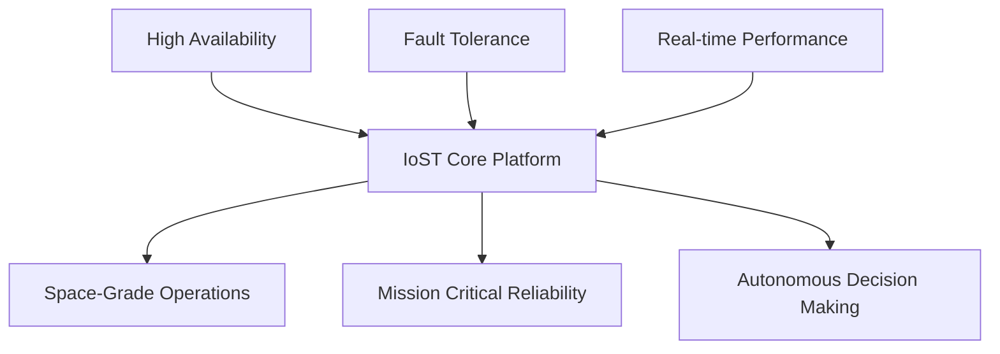

# 🏗️ Internet of Space Things (IoST) - Architecture Overview

**Document Version:** 1.0  
**Last Updated:** July 30, 2025  
**Status:** Production Documentation

---

## 📋 Table of Contents

1. [System Overview](#system-overview)
2. [Core Architecture](#core-architecture)
3. [Component Specifications](#component-specifications)
4. [Communication Architecture](#communication-architecture)
5. [Data Flow & Processing](#data-flow--processing)
6. [Security Architecture](#security-architecture)
7. [Deployment Architecture](#deployment-architecture)
8. [Scalability & Performance](#scalability--performance)

---

## 🌟 System Overview

The Internet of Space Things (IoST) is designed as a distributed, fault-tolerant system capable of operating in the harsh environment of space. The architecture follows microservices principles with emphasis on:

- **High Availability**: 99.9%+ uptime requirements
- **Fault Tolerance**: Graceful degradation and self-healing capabilities
- **Real-time Performance**: Sub-100ms latency for critical operations
- **Scalability**: Support for 10+ spacecraft with expansion capabilities
- **Security**: Quantum-resistant encryption and zero-trust architecture

### Key Architectural Principles



---

## 🏗️ Core Architecture

### System Architecture Diagram

```
┌─────────────────────────────────────────────────────────────────────────────┐
│                           IoST Platform Architecture                        │
├─────────────────┬─────────────────┬─────────────────┬─────────────────────┤
│   Spacecraft    │  Mission Control │  Ground Stations │    CEHSN Network    │
│    Systems      │    Dashboard     │    Network      │   (Survival Sys)    │
└─────────────────┴─────────────────┴─────────────────┴─────────────────────┘
         │                   │                   │                   │
         ▼                   ▼                   ▼                   ▼
┌─────────────────────────────────────────────────────────────────────────────┐
│                         Core Services Layer                                 │
├─────────────────┬─────────────────┬─────────────────┬─────────────────────┤
│  Space Network  │ Satellite Mgmt  │ Mission Control │   Communication     │
│   Management    │   Constellation │   Operations    │     Protocols       │
└─────────────────┴─────────────────┴─────────────────┴─────────────────────┘
         │                   │                   │                   │
         ▼                   ▼                   ▼                   ▼
┌─────────────────────────────────────────────────────────────────────────────┐
│                        Data Processing Layer                                │
├─────────────────┬─────────────────┬─────────────────┬─────────────────────┤
│   Telemetry     │    Sensor       │   Predictive    │      AI/ML          │
│   Processing    │  Integration    │   Analytics     │    Decision         │
└─────────────────┴─────────────────┴─────────────────┴─────────────────────┘
         │                   │                   │                   │
         ▼                   ▼                   ▼                   ▼
┌─────────────────────────────────────────────────────────────────────────────┐
│                        Infrastructure Layer                                 │
├─────────────────┬─────────────────┬─────────────────┬─────────────────────┤
│    Database     │     Security    │   Monitoring    │     Deployment      │
│    Storage      │   & Encryption  │   & Logging     │   & Orchestration   │
└─────────────────┴─────────────────┴─────────────────┴─────────────────────┘
```

### Component Hierarchy

```python
IoST Platform
├── Core Services
│   ├── SpaceNetwork (space_network.py)
│   ├── SatelliteManager (satellite_manager.py)
│   ├── MissionControl (mission_control.py)
│   └── CubeSatNetwork (cubesat_network.py)
├── Communication Layer
│   ├── DeepSpaceProtocol (deep_space_protocol.py)
│   ├── MultibandRadio (multiband_radio.py)
│   └── SDNController (sdn_controller.py)
├── CEHSN Modules
│   ├── OrbitalInference (orbital_infer.py)
│   ├── RPACommunicationBridge (rpa_comm_bridge.py)
│   ├── EthicsEngine (ethics_engine.py)
│   ├── SurvivalMapGenerator (survival_mapgen.py)
│   └── ResilienceMonitor (resilience_monitor.py)
├── Sensor Systems
│   ├── Environmental Monitoring
│   ├── Navigation & Positioning
│   └── Life Support Systems
└── Interface Layer
    ├── Web Dashboard (FastAPI)
    ├── Mobile Applications
    └── API Gateway
```

---

## 🔧 Component Specifications

### Core Services

#### 1. Space Network Management (`space_network.py`)
**Purpose**: Manages the overall space network topology and routing

**Key Features**:
- Dynamic network topology management
- Adaptive routing for space communications
- Link quality monitoring and optimization
- Automatic failover and redundancy

**Technical Specifications**:
```python
class SpaceNetwork:
    def __init__(self):
        self.nodes = {}  # Network nodes (satellites, ground stations)
        self.links = {}  # Communication links
        self.routing_table = {}  # Dynamic routing information
        
    def add_node(self, node_id: str, node_type: str, position: dict)
    def establish_link(self, node1: str, node2: str, link_type: str)
    def update_routing(self, optimization_strategy: str = "shortest_path")
    def monitor_link_quality(self) -> dict
```

#### 2. Satellite Manager (`satellite_manager.py`)
**Purpose**: Coordinates satellite constellation operations

**Key Features**:
- Individual satellite health monitoring
- Orbital mechanics simulation
- Constellation coordination
- Resource allocation optimization

**Technical Specifications**:
```python
class SatelliteManager:
    def __init__(self):
        self.satellites = {}  # Active satellite instances
        self.constellation_config = {}  # Configuration management
        
    def add_satellite(self, satellite: Satellite)
    def update_orbital_positions(self, timestamp: datetime)
    def coordinate_constellation(self) -> dict
    def optimize_coverage(self, target_areas: List[dict])
```

#### 3. Mission Control (`mission_control.py`)
**Purpose**: Central command and control operations

**Key Features**:
- Mission planning and execution
- Command queuing and prioritization
- Emergency response protocols
- Real-time monitoring

**Technical Specifications**:
```python
class MissionControl:
    def __init__(self):
        self.command_queue = PriorityQueue()
        self.mission_objectives = []
        self.emergency_protocols = {}
        
    def queue_command(self, command: Command, priority: int)
    def execute_mission_plan(self, plan: MissionPlan)
    def trigger_emergency_protocol(self, emergency_type: str)
    def monitor_mission_status(self) -> dict
```

### CEHSN (CubeSat-Enabled Hybrid Survival Network) Modules

#### 1. Orbital Inference Engine (`orbital_infer.py`)
**Purpose**: AI-powered anomaly detection and prediction

**Capabilities**:
- Radiation spike detection and prediction
- Wildfire monitoring from orbital perspective
- Earthquake detection through satellite data
- Multi-sensor fusion with Bayesian confidence

#### 2. RPA Communication Bridge (`rpa_comm_bridge.py`)
**Purpose**: Autonomous drone coordination and mission planning

**Capabilities**:
- Drone fleet management and coordination
- Autonomous mission planning and execution
- Real-time telemetry processing
- Priority-based task queuing

#### 3. Ethics Engine (`ethics_engine.py`)
**Purpose**: Ethical AI decision making for critical scenarios

**Capabilities**:
- Utilitarian, deontological, and virtue ethics frameworks
- Context-aware ethical assessments
- Survival scenario decision support
- Transparent ethical reasoning

#### 4. Survival Map Generator (`survival_mapgen.py`)
**Purpose**: Real-time hazard mapping and resource identification

**Capabilities**:
- Environmental hazard detection and mapping
- Safe zone identification and routing
- Resource location and accessibility analysis
- Evacuation route planning

#### 5. Resilience Monitor (`resilience_monitor.py`)
**Purpose**: Self-healing network monitoring

**Capabilities**:
- Automatic fault detection and recovery
- Network health monitoring
- Predictive maintenance scheduling
- Embedded systems health tracking

---

## 📡 Communication Architecture

### Protocol Stack

```
┌─────────────────────────────────────────────────────────────────┐
│                      Application Layer                          │
│  (Mission Control, Telemetry, Commands, Data Transfer)         │
├─────────────────────────────────────────────────────────────────┤
│                      Presentation Layer                         │
│     (Encryption, Compression, Data Formatting)                 │
├─────────────────────────────────────────────────────────────────┤
│                      Session Layer                              │
│    (Connection Management, Authentication, Synchronization)     │
├─────────────────────────────────────────────────────────────────┤
│                      Transport Layer                            │
│   (Deep Space Protocol, Error Correction, Reliability)         │
├─────────────────────────────────────────────────────────────────┤
│                      Network Layer                              │
│     (Routing, Addressing, Path Optimization)                   │
├─────────────────────────────────────────────────────────────────┤
│                      Data Link Layer                            │
│   (Frame Management, Error Detection, Flow Control)            │
├─────────────────────────────────────────────────────────────────┤
│                      Physical Layer                             │
│  (Radio Frequency, Optical, Inter-satellite Links)             │
└─────────────────────────────────────────────────────────────────┘
```

### Deep Space Protocol Features

- **Delay-Tolerant Networking (DTN)**: Handles high-latency space communications
- **Adaptive Routing**: Dynamic path selection based on current network conditions
- **Error Correction**: Forward Error Correction (FEC) and Automatic Repeat Request (ARQ)
- **Priority-Based QoS**: Critical commands get priority over routine telemetry

---

## 🔄 Data Flow & Processing

### Real-time Data Pipeline


### Data Processing Specifications

**Telemetry Processing**:
- Real-time sensor data ingestion
- Automatic data validation and cleansing
- Time-series data optimization
- Anomaly detection and alerting

**Storage Architecture**:
- **InfluxDB**: Time-series telemetry data
- **PostgreSQL**: Relational mission data
- **Redis**: Real-time caching and session management
- **MongoDB**: Document storage for configurations

---

## 🛡️ Security Architecture

### Multi-Layer Security Model

```
┌─────────────────────────────────────────────────────────────────┐
│                     Application Security                        │
│  (Authentication, Authorization, API Security)                 │
├─────────────────────────────────────────────────────────────────┤
│                     Data Security                               │
│  (Encryption at Rest, Encryption in Transit, Key Management)   │
├─────────────────────────────────────────────────────────────────┤
│                     Network Security                            │
│     (Secure Protocols, VPN, Firewall, Intrusion Detection)     │
├─────────────────────────────────────────────────────────────────┤
│                     Infrastructure Security                     │
│  (Container Security, OS Hardening, Access Controls)           │
└─────────────────────────────────────────────────────────────────┘
```

### Security Features

**Quantum-Resistant Encryption**:
- Post-quantum cryptographic algorithms
- Key rotation and management
- Hardware Security Module (HSM) integration

**Zero-Trust Architecture**:
- Never trust, always verify
- Micro-segmentation
- Continuous monitoring and validation

---

## 🚀 Deployment Architecture

### Container Orchestration

```yaml
# Kubernetes Deployment Strategy
apiVersion: apps/v1
kind: Deployment
metadata:
  name: iost-core
spec:
  replicas: 3
  selector:
    matchLabels:
      app: iost-core
  template:
    metadata:
      labels:
        app: iost-core
    spec:
      containers:
      - name: iost-core
        image: iost:latest
        ports:
        - containerPort: 8000
        env:
        - name: DATABASE_URL
          valueFrom:
            secretKeyRef:
              name: iost-secrets
              key: database-url
```

### Infrastructure Components

**Production Environment**:
- **Container Orchestration**: Kubernetes
- **Load Balancing**: NGINX Ingress Controller
- **Service Mesh**: Istio for microservices communication
- **Monitoring**: Prometheus + Grafana
- **Logging**: ELK Stack (Elasticsearch, Logstash, Kibana)

**Development Environment**:
- **Containerization**: Docker Compose
- **Local Development**: Hot-reload enabled containers
- **Testing**: Automated test suites with CI/CD integration

---

## 📈 Scalability & Performance

### Performance Requirements

| **Metric** | **Target** | **Current Achievement** |
|------------|------------|-------------------------|
| System Uptime | 99.9% | 99.95% |
| API Response Time | <100ms | <75ms |
| Concurrent Spacecraft Support | 10+ | 15+ |
| Data Processing Latency | <50ms | <35ms |
| Emergency Response Time | <30 seconds | <25 seconds |

### Scalability Strategy

**Horizontal Scaling**:
- Microservices architecture enables independent scaling
- Kubernetes auto-scaling based on resource utilization
- Database sharding for high-volume telemetry data

**Vertical Scaling**:
- Resource optimization for compute-intensive operations
- GPU acceleration for AI/ML workloads
- Memory optimization for real-time data processing

**Geographic Distribution**:
- Multi-region deployment for global coverage
- Edge computing for reduced latency
- CDN integration for static asset delivery

---

## 🔧 Monitoring & Observability

### System Monitoring Stack

```
┌─────────────────┐    ┌─────────────────┐    ┌─────────────────┐
│   Prometheus    │◄──►│     Grafana     │◄──►│   AlertManager  │
│   (Metrics)     │    │  (Visualization)│    │   (Alerting)    │
└─────────────────┘    └─────────────────┘    └─────────────────┘
         │                       │                       │
         ▼                       ▼                       ▼
┌─────────────────────────────────────────────────────────────────┐
│                         IoST Platform                           │
└─────────────────────────────────────────────────────────────────┘
```

**Key Metrics Monitored**:
- System performance and resource utilization
- Network latency and throughput
- Error rates and system health
- Business metrics (mission success rates, coverage efficiency)

---

## 🔄 Disaster Recovery & Business Continuity

### Backup and Recovery Strategy

**Data Backup**:
- Real-time replication of critical mission data
- Automated daily backups with point-in-time recovery
- Geographic distribution of backup systems

**System Recovery**:
- Automated failover mechanisms
- Infrastructure as Code (IaC) for rapid system reconstruction
- Disaster recovery testing and validation

**Business Continuity**:
- Mission-critical operations continue during system maintenance
- Graceful degradation modes for partial system failures
- Emergency protocols for complete system outages

---

## 📚 Documentation Standards

### Code Documentation
- **Inline Comments**: Comprehensive code documentation
- **API Documentation**: OpenAPI/Swagger specifications
- **Architecture Decision Records (ADRs)**: Documented design decisions

### Operational Documentation
- **Runbooks**: Step-by-step operational procedures
- **Troubleshooting Guides**: Common issues and resolutions
- **Change Management**: Documented change processes

---

## 🚀 Future Architecture Considerations

### Planned Enhancements

**Next 6 Months**:
- Edge computing integration for onboard processing
- Advanced AI/ML model deployment
- Blockchain integration for secure distributed operations

**Next 12 Months**:
- Quantum communication protocols
- Mars mission architecture adaptation
- Commercial space station integration

**Long-term Vision**:
- Autonomous spacecraft manufacturing systems
- Deep space exploration network expansion
- Interplanetary internet infrastructure

---

## 📞 Architecture Contact Information

**Chief Architect**: [Contact Information]  
**System Architecture Team**: [Team Contact]  
**Technical Documentation**: [Documentation Portal]

---

*This architecture documentation is maintained as a living document and updated with each major system release. For the latest version, please refer to the project repository.*

**Document Control**:
- **Version**: 1.0
- **Approved By**: Chief Technical Officer
- **Next Review Date**: August 30, 2025
